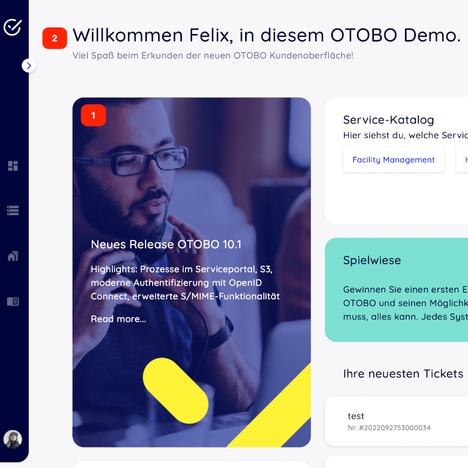

Adapt customer interface with corporate identity
================================

In OTOBO it is very easy to adapt the customer area to your own corporate identity. 
Follow this tutorial step by step and OTOBO will shine in your own design in a short time.

.. note::

   Currently, it is not so easy to adapt the agent area to one's own CI. Changes in the OTOBO .css files would be necessary here. 
   One exception is the logo on the agent login page and the agent header. The logos can be easily exchanged by copying the logos to the 
   server and then adjusting the options ``AgentLoginLogo`` and ``AgentLogo`` under ``Admin -> System Configuration``.

Change colors in Customer Area
--------------------------------

To change the colors for the OTOBO customer interface, please go to ``Admin -> System Configuration`` and change the following settings:

* CustomerColorDefinitions
* To change the colours on the Customer Dashboard, please go to `Admin -> System Configuration`` and search for CustomerDashboard. In the search result you will find all the options you need with colour definitions.

Change Logos and Pictures
----------------------------------------------

In the first step please copy your Logos and Pictures to the OTOBO Server.
Please use an SCP client (WinSCP) for this purpose. 
Often you do not have the permissions to copy the logos to the right place. In this case, it is best to use the folder /tmp/.

In the next step copy the Logo into the OTOBO Home directory:

.. code-block:: bash
    
    **# Using OTOBO Docker Installation**
    otobo_admin> docker cp /tmp/Logos.png otobo_web_1:/opt/otobo/var/httpd/htdocs/skins/Customer/default/img/ 

    **# Nativ installation in /opt/otobo/**
    otobo_admin> cp /tmp/Logos.png /opt/otobo/var/httpd/htdocs/skins/Customer/default/img/ 

Now change inside the OTOBO Agent Interface to ``Admin -> System Configuration`` and change the following settings:

Change Customer Login Pictures and Text
~~~~~~~~~~~~~~~~~~~~~~~~~~~~~~~~~~~~~~~

* 1 and 2 - System Configuration Option **CustomerLogin::Settings**

**Remove Opacity and Watermark**
    
At the moment it is not possible to remove the overlay and watermark used in the image on the right by system configuration. 

To remove the opacity, please adjust the option **#oooLoginBG > .oooBG** in the file 

``var/httpd/htdocs/skins/Customer/default/css/Core.Login.css``

.. bash::

     #oooLoginBG > .oooBG {
        position: relative;
        width: 100%;
        height: 100%;
     /*   opacity: 0.45; Disable opacity */
        background-size: cover;
        overflow: hidden;
    }

To remove the watermark, please remove the following line inside the file:

``Kernel/Output/HTML/Templates/Standard/CustomerLogin.tt``

.. bash::
    
    <!-- start login -->
    

        

#            

        

        <h1>[% Translate(Data.LoginText) | html %]</h1>
    

    

.. note::

    Please add the files to a opm package in the next step, so that the changes remain persistent. You can find instructions on how to do this in our    
    Admin Manual: https://doc.otobo.org/manual/developer/10.1/en/content/how-to-publish-otobo-extensions.html

Change Customer Dashboard tiles and options
~~~~~~~~~~~~~~~~~~~~~~~~~~~

To change the colours on the Customer Dashboard, please go to ``Admin -> System Configuration`` and search for **CustomerDashboard**. 

In the search result you will find all the options you need with colour definitions.

* 1 - To change the picture, link and text please use the System Configuration Option **CustomerDashboard::Tiles###FeaturedLink-01**
* 2 - To change the toplevel text please use the System Configuration Option **CustomerDashboard::Configuration::Text**

.. note::

   Please disable the config options from not needed tiles.
